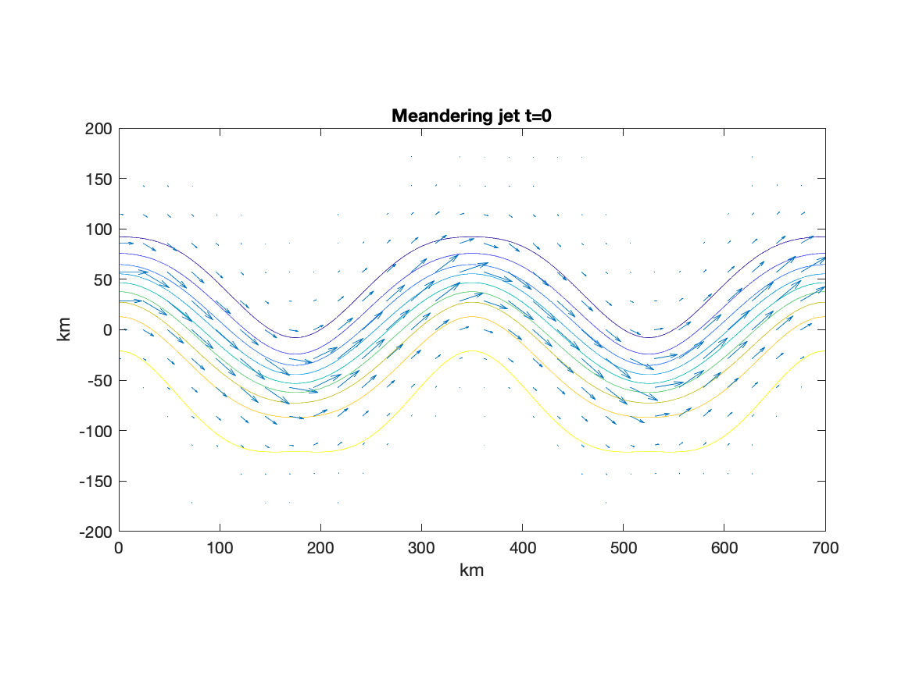

AdvectionDiffusionModels
==============

The advection-diffusion models consist of two-dimensional kinematic fluid velocity fields which can be used to advect particles with a specified diffusivity. This project also contains code to estimate kinematic model parameters *from* a given set of particles. 

### Table of contents
1. [Quick start](#quick-start)
2. [Kinematic models](#kinematic-models)


------------------------

Quick start
------------

Start by initializing and visualizing a kinematic model,
```matlab

jet = MeanderingJet();
figure
jet.plotStreamfunction(), hold on
jet.plotVelocityField()
```
<p align="center"></p>
This meandering jet example is bounded in the y-direction, and periodic in the x-direction.

Now let's add some particles


Kinematic models
------------

A kinematic model (in this context) is a parametric two-dimensional fluid velocity field which may or may not be time-dependent.

