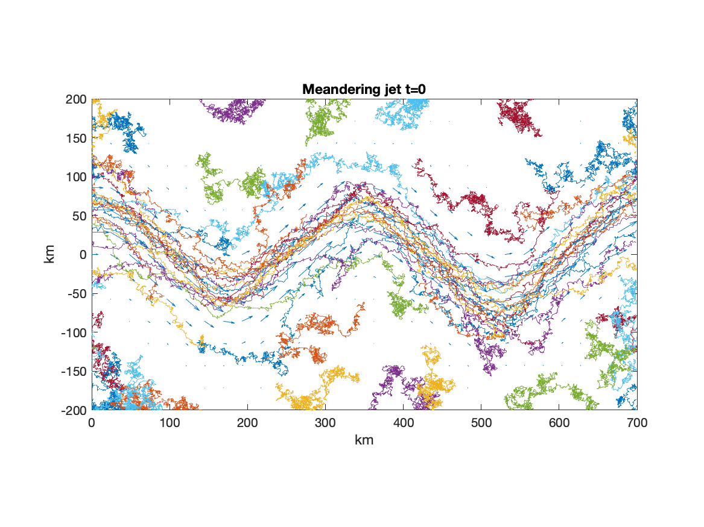
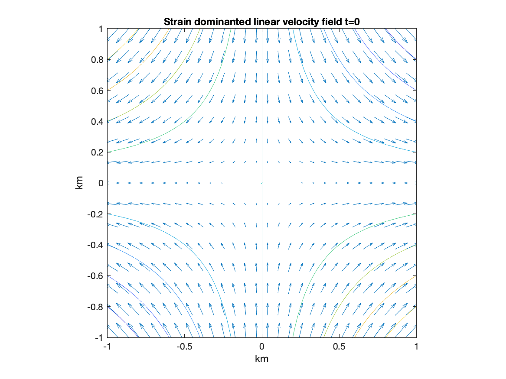
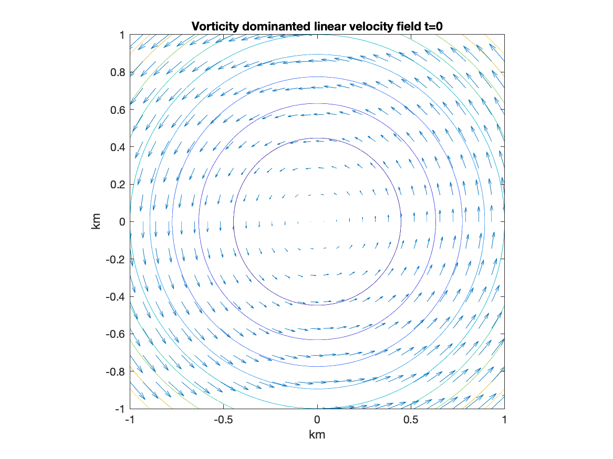
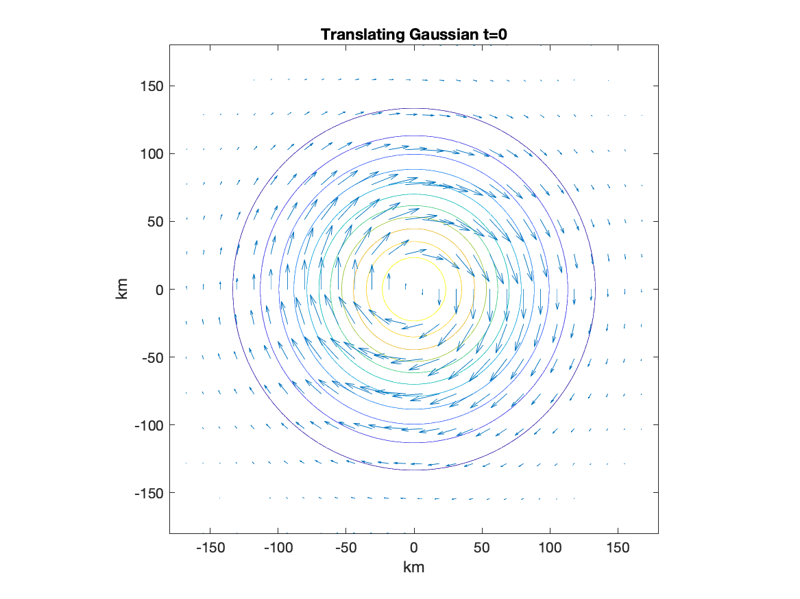
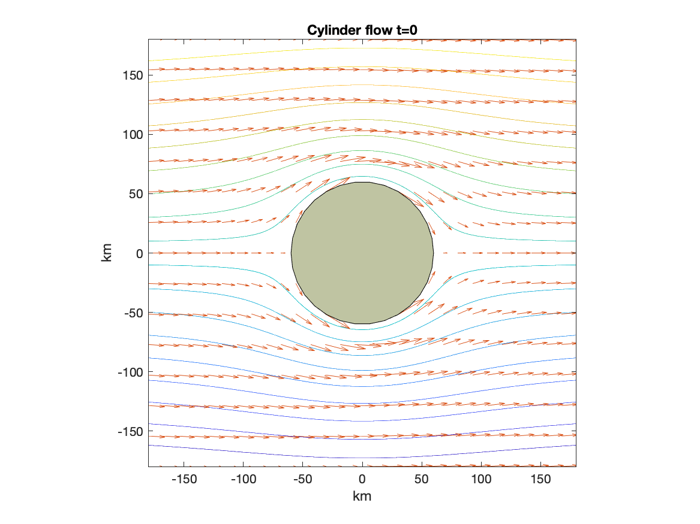

Advection Diffusion Models
==============

The advection-diffusion models consist of two-dimensional kinematic fluid velocity fields which can be used to advect particles with a specified diffusivity. This project also contains code to estimate kinematic model parameters *from* a given set of particles. 

### Table of contents
1. [Quick start](#quick-start)
2. [Kinematic models](#kinematic-models)


------------------------

Quick start
------------

Start by initializing and visualizing a kinematic model,
```matlab

jet = MeanderingJet();
figure
jet.plotStreamfunction(), hold on
jet.plotVelocityField()
```
<p align="left"></p>
This meandering jet example is bounded in the y-direction, and periodic in the x-direction.

Now that we have a `KinematicModel` initialized, we can use that in the `AdvectionDiffusionIntegrator`. 
```matlab
kappa = 1e3;
integrator = AdvectionDiffusionIntegrator(jet,kappa);
```
Let's choose appropriate time scales to integrate
```matlab
T = 5*jet.Lx/jet.U;
dt = 864;
```
and place particles throughout the valid domain
```matlab
x = linspace(min(jet.xlim),max(jet.xlim),6);
y = linspace(min(jet.ylim),max(jet.ylim),6);
[x0,y0] = ndgrid(x,y);
```
Finally, we now use the integrator to generate some trajectories
```matlab
[t,x,y] = integrator.particleTrajectories(x0,y0,T,dt);

figure
jet.plotVelocityField(), hold on
jet.plotTrajectories(x,y)
```
<p align="left"></p>

Kinematic models
------------

A kinematic model (in this context) is a parametric two-dimensional fluid velocity field which may or may not be time-dependent.

<p align="left"></p>

<p align="left"></p>

<p align="left"></p>
<p align="left"></p>
<p align="left"></p>
