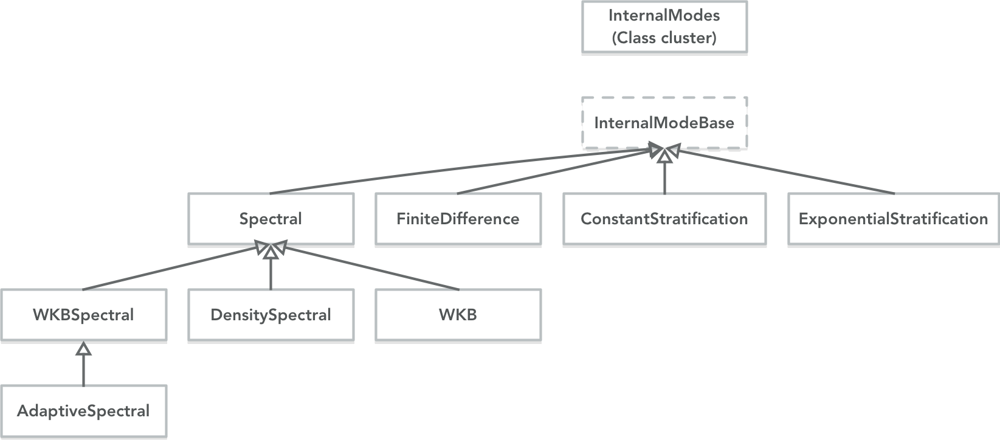

InternalModes
==============

The InternalModes class can be used to quickly and accurately compute the vertical modes and SQG modes from arbitrary stratification.

The complete class hierarchy contains several implementations that include spectral methods, finite differencing, WKB approximated solutions, as well as the analytical solutions for constant stratification and exponential stratification. The details are documented in Early, Lelong, and Smith (2018).

The classes contain many options, but also try to remain simple to use. Use `help InternalModes` in Matlab for a complete description, or use the Quick Start below.

If you use these classes to compute the vertical modes, please cite the following paper,
- J. Early, M. P. Lelong, and K. S. Smith. Fast and Accurate Coputation of Vertical Modes. Journal of Advances in Modeling Earth Systems. 2020. [doi](https://doi.org/10.1029/2019MS001939)

### Table of contents
1. [Quick Start](#quick-start)
2. [Convenience functions](#convenience-functions)
3. [Constant and exponential stratification](#constant-and-exponential-stratification)
4. [Built-in density profiles](#built-in-density-profiles)
5. [Normalization and boundary conditions](#normalization-and-boundary-conditions)
6. [Name/value pairs](#namevalue-pairs)
7. [Numerical methods](#numerical-methods)
8. [Class hierarchy](#class-hierarchy)
9. [Internal modes class cluster](#internal-modes-class-cluster)
10. [Unit testing](#unit-testing)

------------------------

Quick start
------------

The preferred method for initializing the InternalModes class is to define density as a function, e.g.,
```matlab
N0 = 5.2e-3; % reference buoyancy frequency, radians/seconds
g = 9.81;
rho0 = 1025; % density at the surface
b = 1300;
rho = @(z) rho0*(1 + b*N0*N0/(2*g)*(1 - exp(2*z/b)));
```
and then use that function to initialize the class,
```matlab
L = -5000;
zOut = linspace(L,0,200)';
latitude = 33;
im = InternalModes(rho,[L 0],zOut,latitude);
```
The `InternalModes` class is initialized with four arguments: the density function, an array specifying the domain bounds (lower and upper boundary), the the output grid upon which all returned functions will be given, and the latitude.

Now that the `im` object is initialized, you can request the internal modes at a given wavenumber, `k`, where k is 2*pi/wavelength.
```matlab
   [F,G,h,omega] = im.ModesAtWavenumber(2*pi/1000);
   ```
or frequency `omega`,
```matlab
   [F,G,h,k] = im.ModesAtFrequency(5*im.f0);
   ```
The arrays `F` and `G` contain the vertical modes for u/v and w/rho, respectively. The arrays have dimensions `size(F)=[length(zOut) length(h)]`, meaning that each column `i` is a normal mode, `F(:,i)` with corresponding eigendepth `h(i)`. The associated eigenfrequency or eigenwavenumber are also returned for convenience.

You can also request the surface quasigeostrophy (SQG) modes,
```matlab
psi_t = im.SurfaceModesAtWavenumber(2*pi/1000);
psi_b = im.BottomModesAtWavenumber(2*pi/1000);
```
The functions can also take arrays of wavenumbers of any shape or size.

Note that you can also request variations of the density, e.g.,
```matlab
   N2 = im.N2;
   rho_zz = im.rho_zz;
   ```
which will be on the same output grid `zOut` that you specified.


Although it is best to use initialize using a density function, you can also initialize using gridded data if needed. The syntax is nearly the same,
```matlab
N0 = 5.2e-3; % reference buoyancy frequency, radians/seconds
g = 9.81;
rho0 = 1025; % density at the surface
b = 1300;
z = linspace(-5000,0,500)';
rho = rho0*(1 + b*N0*N0/(2*g)*(1 - exp(2*z/b)));

im = InternalModes(rho,z,zOut,latitude);
```
where now you pass the gridded density data, `rho`, and its coordinate, `z`.

Convenience functions
------------
Once the `InternalModes` objects is initialized there are a few notable convenience functions. You can use,
```matlab
im.ShowLowestModesAtWavenumber(2*pi/1000)
```
and

```matlab
im.ShowLowestModesAtFrequency(5*im.f0)
```
to quickly visualize the four lowest modes.

Constant and exponential stratification
------------

Both constant and exponential stratification profiles have exact analytical solutions that have been implemented directly. Initialization follows the same basic format, but rather than specify a density profile, you specify the parameters for the stratification. For example,
```matlab
N0 = 5.2e-3;
imConst = InternalModesConstantStratification(N0,[L 0],zOut,latitude);
```
will initialize a constant stratification profile with buoyancy frequency given by `N0`, and
```matlab
N0 = 5.2e-3;
b = 1300;
imExp = InternalModesExponentialStratification([N0 b],[L 0],zOut,latitude);
```
will initialize an exponential stratification profile with surface buoyancy frequency of `N0` and e-fold scale of `b`. 

Built-in density profiles
------------

For testing purposes and convenience, there are a number of pre-defined density profiles that you can access. Simply call,
```matlab
[rho,N2,zIn] = InternalModes.StratificationProfileWithName(stratification)
```
where the variable `stratification` is a string. The returned values `rho` and `zIn` can be used directly as the first two arguments in initialization. The following options are available:
 - `'constant'` A constant stratification profile.
 - `'exponential'` The standard Garrett-Munk exponential profile.
 - `'pycnocline-constant'` Constant stratification with a pycnocline, taken from Cushman-Roisin & Beckers.
 - `'pycnocline-exponential'` Exponential profile with a deep pycnocline.
 - `'latmix-site1'` Attempts to recreate the full stratification profile (down to 5000 meters) at Latmix site 1, with an intense surface mixed layer and deep pycnocline.
 - `'latmix-site1-surface'` Recreates just the near surface features at Latmix Site 1.
 - `'latmix-site1-exponential'` Recreates the surface mixed layer and associated pycnocline, and then decays exponentially below 190m.
  - `'latmix-site1-constant'` Recreates the surface mixed layer and associated pycnocline, but then goes constant below 300m.
  
Normalization and boundary conditions
-------------------
There are four choices for normalization of the vertical modes. See in Early, et al. (2018) for details.
- `kConstant` (default) Uses the K-constant norm, which is useful for specifying energy density of an internal wave.
- `omegaConstant` Uses the omega-constant norm, the utility of which isn't exactly clear.
- `uMax` Sets the maximum of the F modes to 1. Useful if you want to specify the horizontal velocity of a wave.
- `wMax` Sets the maximum of the G modes to 1. Useful if you want to specify the vertical velocity of a wave.

These constants are defined as an `enumeration` class, and would be called as,
```matlab
im.normalization = Normalization.uMax
```
before you request the modes.

The upper boundary condition can be specified as a rigid lid (default) or as a free surface (there is no reduced-gravity option yet). For example,
```matlab
im.upperBoundary = UpperBoundary.freeSurface
```
will use the free surface condition at the upper boundary when solving the EVP.

Name/value pairs
-----------------
During initialization you can specify options and set properties using a name/value pair syntax. For example, to specify the upper boundary condition during initialization, you could write
```matlab
im = InternalModes(rho,[L 0],zOut,latitude,'upperBoundary',UpperBoundary.freeSurface);
```
You can add as many name/value pairs as needed.

Numerical methods
---------------
There are multiple different numerical methods for solving the eigenvalue problem (EVP), some of which may work better than others, depending on the density profile in question. During initialization, you can specify which numerical method you want to use to solve the EVP.

For example, to initialize using finite differencing, you can call,
```matlab
imFD = InternalModes(rho,[L 0],zOut,latitude,'method','finiteDifference');
```

The following different methods are available
- `'spectral'` Uses Chebyshev polynomials on a z coordinate.
- `'wkbSpectral'` Uses Chebyshev polynomials on a WKB stretched coordinate.
- `'densitySpectral'` Uses Chebyshev polynomials on a density coordinate.
- `'wkbAdaptiveSectral'` (default) Uses coupled EVPs with Chebyshev polynomials on a WKB stretched coordinate, depending on the frequency requested.
- `'finiteDifference'` Uses finite differencing techniques.
- `'wkb'` Uses the analytical WKB solutions (only valid for frequency, and at most one turning point).
- `'wkb-hydrostatic'` Uses a hydrostatic form of the WKB solution as seen in Levine (2002).

Some of these methods take additional options.
### Spectral
All of the spectral methods have two other properties that can be specified on initialization, `nGrid` and `nEVP`.
- `nGrid` specifies the number of points that should be used to compute the derivatives of the density function (which is always on the z coordinate). These computations are done in O(n log n) time, so a relatively large number of points can be used here. The default is 2^14+1.
- `nEVP` specifies the number of points used in the eigenvalue problem on the stretched coordinate (either z, density or wkb). This is a relatively expensive operation which scales as O(n^3). The default is 513 points.

### FiniteDifference
The finite difference matrices are always computed on the given input grid, and the results are interpolated onto the output grid. However, you can specify the accuracy of the finite difference matrices.
- `orderOfAccuracy` The lowest appropriate value is 2 (which is the usual approach taken), and the default is 4.


Class hierarchy
----------------

The `InternalModes` class is actually a class cluster, that is used to initialize any one of a number of concrete subclasses which inherit from the `InternalModesBase` class.

When you initialize the `InternalModes` class, internally it then initializes one of the concrete subclasses and simply passes all (most) calls to the concrete subclasses.

This means that you can choose to initialize one of the concrete subclasses directly, and simply bypass the `InternalModes` class cluster.

Internal modes class cluster
------------------
The `InternalModes` class cluster contains several methods that are not in the `InternalModesBase` class.

### Quick Initialization and Test Cases
The class cluster can be initialized quickly for a test cases with the following syntax,
```matlab
im = InternalModes(stratification, method, nPoints)
```
where the defaults (if not given) are `stratification='constant'`, `method='wkbAdaptiveSpectral'`, and `nPoints=64`.

If you initialize with this test case method, you can then call either
```matlab
im.ShowRelativeErrorAtWavenumber(2*pi/1000)
```
or

```matlab
im.ShowRelativeErrorAtFrequency(5*im.f0)
```
to estimate the error.

Unit testing
------------------

The folder `UnitTests` constains two functions that use the analytical solutions from constant and exponential stratification to unit test against the numerical methods.
-`InternalModeRelativeErrorTests.m` computes the internal mode solution at three different wavenumbers and three different frequencies, returning the number of 'good' modes (modes with less than 1 percent error). The test should be run with both surface boundary conditions.
-`SQGModeRelativeErrorTests.m` computes the surface and bottom boundary SQG mode solutions at a range wavenumbers, returning the relative error.
