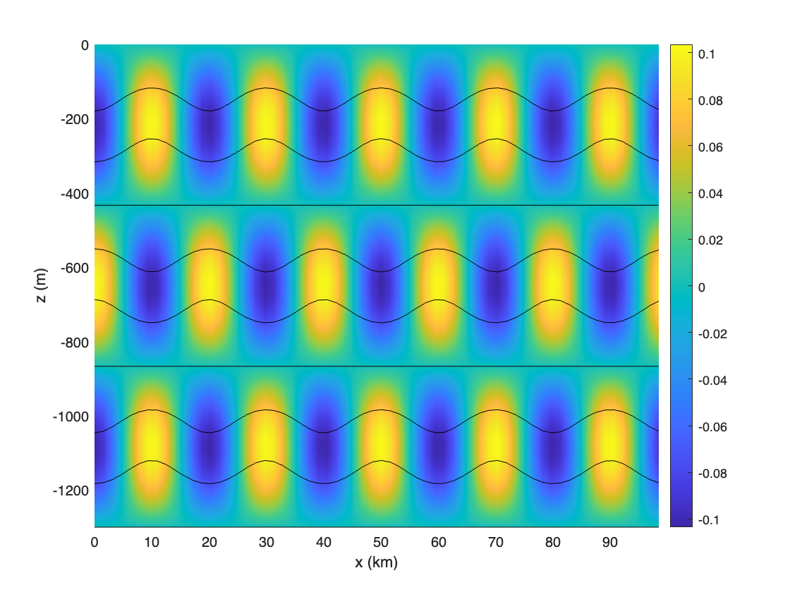
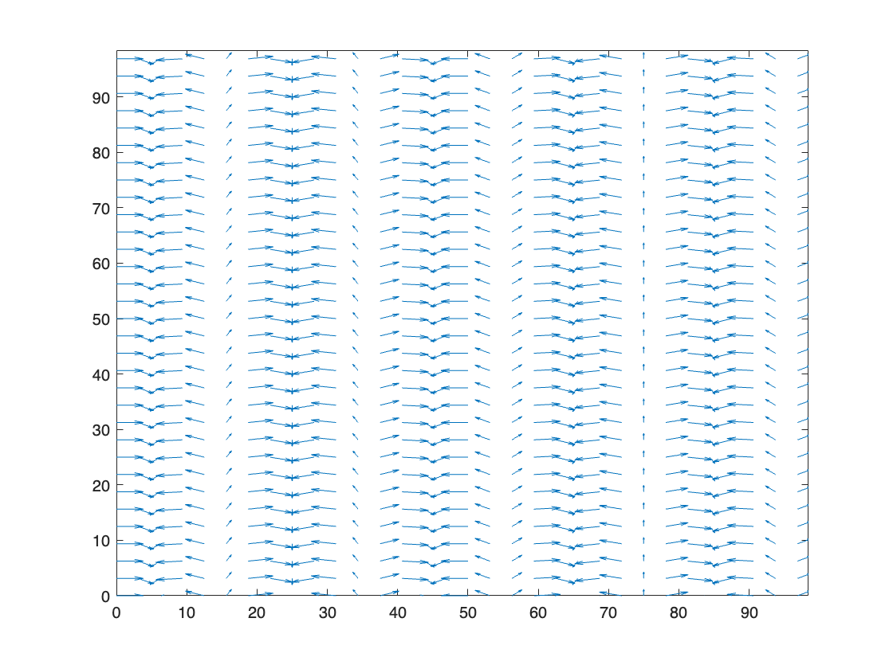
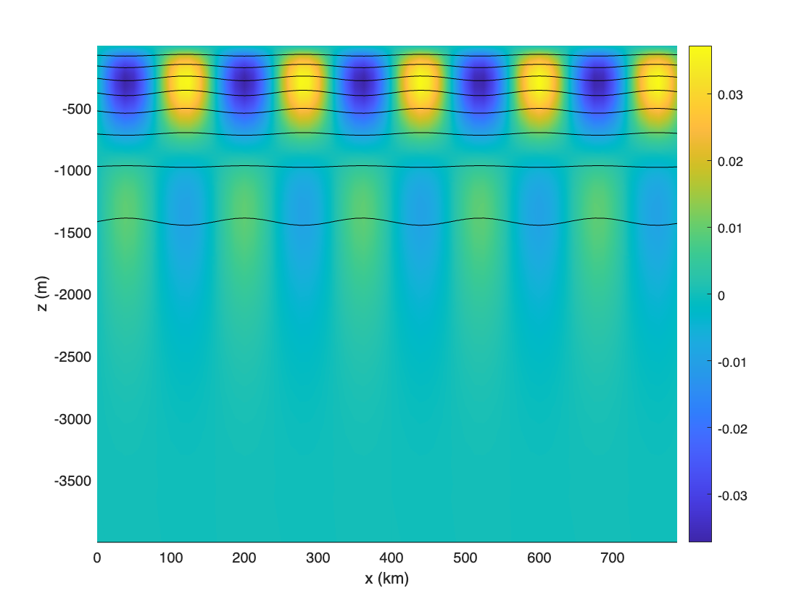

# Initialize a wave vortex transform
```matlab
wvt = WVTransformConstantStratification([100e3, 100e3, 1300],[64, 64, 65], N0=5.2e-3,latitude=30);
```

```matlabTextOutput
Using the analytical form for constant stratification N0=0.0052
Warning: Need to check 2*(Nz-1), it gets extended to 2*Nz-1 during simulation
The operation nonlinearFlux with variables {Fp,Fm,F0,} has been removed and the operation WVNonlinearFlux with variables {Fp,Fm,F0,} has been added.
```
# Add an internal wave
```matlab
[omega,k,l]=wvt.initWithWaveModes(k=5,l=0,j=3,phi=0,u=0.2,sign=1);
```
# Make a few plots
```matlab
wvt.t = (2*pi/omega)*0.5;
figure
pcolor(wvt.x/1000,wvt.z,squeeze(wvt.rho_prime(:,1,:)).'); colorbar; clim([min(wvt.rho_prime(:)),max(wvt.rho_prime(:))]), shading interp, hold on
contour(wvt.x/1000,wvt.z,squeeze(wvt.rho_total(:,1,:)).',linspace(min(wvt.rho_total(:)),max(wvt.rho_total(:)),10),'k','LineWidth',0.5);
xlabel('x (km)'), ylabel('z (m)')
```



```matlab
figure
quiver(wvt.x(1:2:end)/1000,wvt.y(1:2:end)/1000,squeeze(wvt.u(1:2:end,1:2:end,1)).',squeeze(wvt.v(1:2:end,1:2:end,1)).')
xlim([min(wvt.x/1000) max(wvt.x/1000)]), ylim([min(wvt.y/1000) max(wvt.y/1000)])
```


# Initialize a new wave vortex transform
```matlab
N0 = 3*2*pi/3600;
L_gm = 1300;
N2 = @(z) N0*N0*exp(2*z/L_gm);
wvt = WVTransformHydrostatic([800e3, 800e3, 4000],[64, 64, 65], N2=N2,latitude=30);
```

```matlabTextOutput
Warning: Condition number is 131312286090562.718750 the vertical transformations.
The operation nonlinearFlux with variables {Fp,Fm,F0,} has been removed and the operation WVNonlinearFlux with variables {Fp,Fm,F0,} has been added.
```
# Add an internal wave
```matlab
[omega,k,l]=wvt.initWithWaveModes(k=5,l=0,j=2,phi=0,u=0.2,sign=1);
%wvt.initWithGMSpectrum(1.0);
```
# Make a few plots
```matlab
wvt.t = (2*pi/omega)*0.25;
figure
pcolor(wvt.x/1000,wvt.z,squeeze(wvt.rho_prime(:,1,:)).'); colorbar; clim([min(wvt.rho_prime(:)),max(wvt.rho_prime(:))]), shading interp, hold on
contour(wvt.x/1000,wvt.z,squeeze(wvt.rho_total(:,1,:)).',linspace(min(wvt.rho_total(:)),max(wvt.rho_total(:)),10),'k','LineWidth',0.5);
xlabel('x (km)'), ylabel('z (m)')
```


